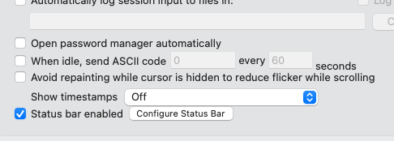

# Vundle install

```
git clone https://github.com/gmarik/Vundle.vim.git ~/.vim/bundle/Vundle.vim
```
# dotfiles

맥 새로 셋팅하면 지금 맥과 동일한 환경을 위해 아래와같이 사용 ㄱㄱ

```
ln -s .dotfiles/.vimrc ~/.vimrc
ln -s .dotfiles/.gitignore_global ~/.gitignore_global
ln -s .dotfiles/.gitconfig ~/.gitconfig
ln -s .dotfiles/.zshrc ~/.zshrc
```
vim theme hybrid

```
git clone https://github.com/w0ng/vim-hybrid.git
mkdir .vim/colors
mv ~/vim-hybrid/colors/hybrid.vim ~/.vim/colors/hybrid.vim
```


## git config
```
$ git config --global user.name "yevgnenll"
$ git config --global user.email yevgnenll@gmail.com 
$ git config --global core.editor vim
$ git config --global core.excludesfile ~/.gitignore_global
```

## copy하기

```
$ cp ~/.vimrc ~/.dotfiles/
$ cp ~/.gitignore_global ~/.dotfiles/
$ cp ~/.gitconfig ~/.dotfiles
$ cp ~/.zshrc ~/.dotfiles
$ cp ~/.bash_profile ~/.dotfiles
$ cp ~/.bashrc ~/.dotfiles
```

[tmux ctrl + b -> capslock 설정](https://gist.github.com/burtlo/3788048)

처음 셋팅할때 요렇게 복사해서 따로 모아둠

## ` 기호가 안나올 때

```
curl -sSL https://gist.githubusercontent.com/redism/43bc51cab62269fa97a220a7bb5e1103/raw/0d55b37b60e0e0bd3d0d7f53995de0a722f9820c/kr_won_to_backquote.sh | sh
```

[참조](https://ohseyong.github.io/macos/won-to-backquote/)

# iTersm

## oh my zh

### plugin

```
git clone https://github.com/zsh-users/zsh-autosuggestions ~/.oh-my-zsh/custom/plugins/zsh-autosuggestions
git clone https://github.com/zsh-users/zsh-syntax-highlighting.git ~/.oh-my-zsh/custom/plugins/zsh-syntax-highlighting
```

## system util


